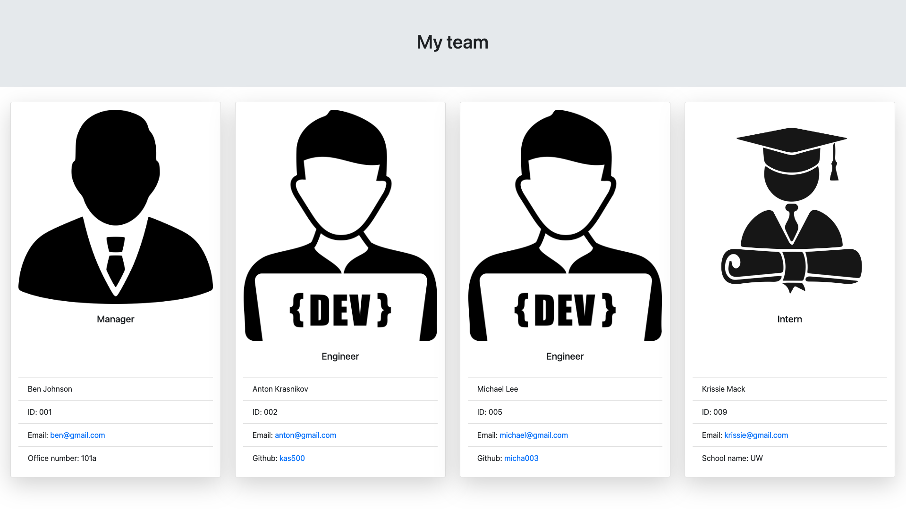

# Team Profile Generator (Object-Oriented Programming Challenge). 
  
## Description
  
Team Profile Generator is an application that allows you to create your Team's web page automatically by entering the appropriate information on the command line.

## Table of Contents
- [Installation](#installation)
- [Usage](#usage)
- [Contributing](#contributing)
- [Test instructions](#test-instructions)
- [License](#tlicense)
- [Questions](#questions)

## Installation

For the application to work correctly, you need to download and install Node.js and npm.  Detailed instructions can be found by clicking on the link <https://nodejs.org/en/>.  You also need to install inquirer 8.2.4 (the instruction is available at the link <https://www.npmjs.com/package/inquirer>.
  
## Usage
  
in order to use the application, you need to open a terminal window and switch to the current directory with the index.js file.  Then run the application by entering the node index.js command.  After th"at, you need to enter the information requested by the application. 
### Screen record (link)
https://github.com/kas500/team-profile-generator/blob/main/video.mov

### Web page screenshot

  
## Contributing

Pull requests are welcome. For major changes, please open an issue first to discuss what you would like to change. Please make sure to update tests as appropriate.

## Test instructions

in order to test the application use the command "npm run test" from folder "__tests__". The folder contains unit tests for Employee, Engineer, Imntern and Manager classes.

## License

### The MIT license
  (https://opensource.org/licenses/MIT)

## Questions

If you have any questions please contact me any time!

My GitHhub: <https://github.com/kas500>

My email: <krasnikovanton84@gmail.com>
